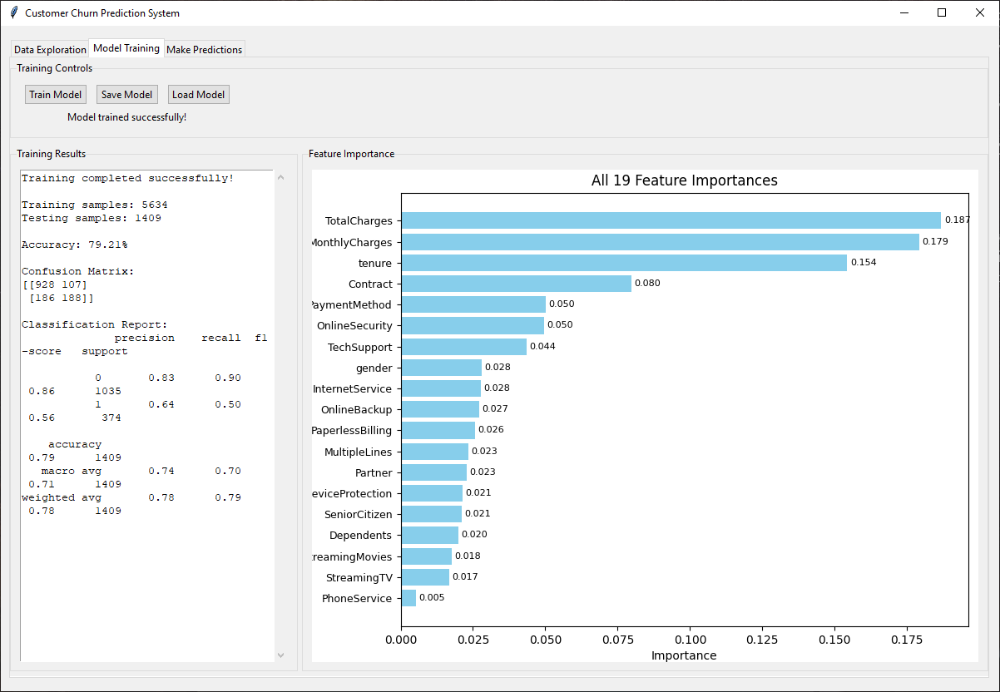

# 📉 Customer Churn Prediction System


🖥️ **GUI Application:** Desktop app using Tkinter  
🧠 **Model Type:** Random Forest Classifier  
💼 **Purpose:** Predict whether a customer will churn based on service and usage details.  

---

## 📋 Project Overview

This project is a Python-based GUI application for predicting customer churn. It features a graphical interface for loading datasets, training a machine learning model, and making predictions on new data. The application is tailored to provide business insights by allowing users to assess which customers are at risk of leaving a service.

Key functionalities include:

- **Data Loading and Exploration**: Load customer datasets (CSV), inspect structure, check nulls, types, and value distributions.
- **Visualization**: See churn distribution and feature importance graphs.
- **Preprocessing**: Encodes categorical variables and scales numerical values.
- **Model Training**: Uses `RandomForestClassifier` from scikit-learn to train a churn prediction model.
- **Model Persistence**: Save and reload models using `joblib`.
- **Prediction Interface**: Input customer attributes (sample/random/manual) to get churn predictions with confidence levels.

---

## 🛠️ Technologies Used

- **Python 3**
- **Tkinter** – GUI framework
- **Pandas / NumPy** – Data handling
- **Seaborn / Matplotlib** – Data visualization
- **Scikit-learn** – ML model, preprocessing, evaluation
- **Joblib** – Model saving/loading

---

## 🚀 How to Run

1. Install required libraries:
```bash
pip install -r requirements.txt
```

2. Run the application:
```bash
python churn_gui.py
```

3. Load a dataset (`CSV`), train a model, make predictions, and visualize results.

---

## 📸 Screenshots

### 📊 **Data Exploration**  


---

### 🧪 **Model Training**  


---

### 🔮 **Make Predictions**  


---

## 🎥 Preview


---

## 🎯 Features Breakdown

### 📁 Load CSV File
- Select and load a CSV file with customer data.
- Displays file name, shape, column data types, nulls, and unique values.

### 📊 Data Exploration
- Shows churn class balance (e.g., Yes/No counts and percentages).
- Displays this visually using bar charts.

### ⚙️ Data Preprocessing
- Converts `TotalCharges` to numeric, handles missing values.
- Label encodes categorical features and target.
- Separates features and labels.

### 🧪 Model Training
- Trains `RandomForestClassifier` on 80% of data, stratified split.
- Shows accuracy, confusion matrix, and classification report.
- Plots and ranks all features by importance.

### 💾 Model Save/Load
- Save your trained model and encoders.
- Load previously saved model to make new predictions.

### 🧮 Predictions
- Input new customer info manually or use sample/random fill.
- Predicts churn (Yes/No) and shows model confidence.
- Colors prediction text (green for No, red for Yes).

---

## 📁 File Structure

```bash
📦 AI Lab Final Project
 ┣ 📂 data
 ┃ ┗ 📄 churn.csv
 ┣ 📂 assets
 ┃ ┗ 📄 data.png
 ┃ ┗ 📄 model.png
 ┃ ┗ 📄 prediction.png
 ┃ ┗ 📄 preview.gif
 ┣ 📂 model
 ┣ 📄 churn_gui.py
 ┣ 📄 LICENSE
 ┣ 📄 requirements.txt
 ┗ 📄 README.md
```
---

## 📄 License

This project is licensed under the [MIT License](LICENSE) - see the [LICENSE](LICENSE) file for details.

---

## ✍️ Author

**Muhammad Huzaifa Karim**  
[GitHub Profile](https://github.com/huzaifakarim1)

---

## 📬 Contact

Feel free to reach out if you have any questions or feedback!  
Email: karimhuzaifa590@gmail.com

---

© 2025 Muhammad Huzaifa Karim